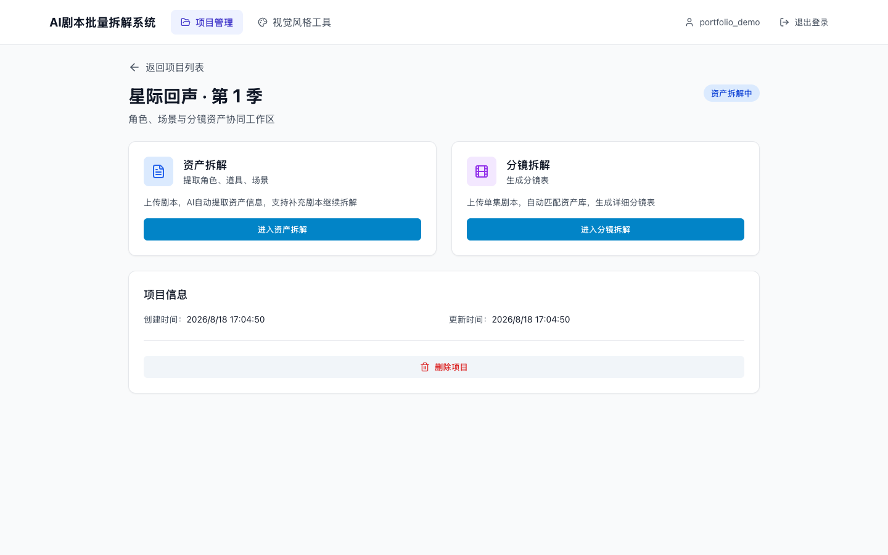

<div align="center">

# AI Drama Production Studio

**把分集剧本整理成可追踪的角色、场景、道具与分镜生产资料。**

[Quick Start](#quick-start) · [Workflow](#workflow) · [Architecture](#architecture) · [Security](#security-boundary)

</div>



## Why this project

短剧和 AI 动画制作常常把人物设定、场景、道具和分镜散落在多个文档里。这个项目把它们放进同一个项目工作区：先建立资产库，再以锁定的资产为约束生成分镜，减少跨集角色和场景漂移。

## Workflow

1. 创建项目并按集导入 DOCX 或剧本文本。
2. 使用选定的模型提取角色、场景和道具。
3. 检查相似资产，人工确认合并并锁定资产库。
4. 按镜头数量、时长和视觉风格生成分镜。
5. 在表格中修订结果，导出 CSV/Excel 或复制到后续生产流程。

## What is implemented

- 多项目、多剧集管理和用户认证
- Claude、DeepSeek、Gemini、OpenAI 兼容模型适配
- 角色、场景、道具提取与相似资产合并
- 分镜生成、编辑、删除、复制和 CSV 导出
- 资产快照、分镜引用关系与管理后台
- Docker Compose 本地部署

## Quick Start

Requirements: Docker Desktop, at least one supported model API key, and 4 GB of free memory.

```bash
git clone https://github.com/5JjiaLin/ai-drama-production-studio.git
cd ai-drama-production-studio
cp .env.example .env
# Edit .env and set at least one provider key plus a new SECRET_KEY.
docker compose up --build
```

Open `http://localhost:3000`. Create an administrator interactively when needed:

```bash
docker compose exec backend python create_admin.py
```

For non-Docker development and provider configuration, see [Docker setup](docs/setup/docker.md) and [API key setup](docs/setup/api-keys.md).

## Architecture

```text
React + TypeScript ── /api/* ──> Flask API ──> SQLite
                                      │
                                      └──> AI provider adapters
```

The browser never receives model-provider credentials. Vite proxies `/api` during development; Nginx proxies the same path in the production container.

## Verification

```bash
npm ci
npm run build

python3 -m pip install -r backend/requirements.txt
(cd backend && python3 -m unittest discover tests)
```

## Security boundary

- Provider keys and `SECRET_KEY` belong only in the backend `.env` file.
- There is no default administrator account or hard-coded password.
- The included setup is intended for local or access-controlled deployment. Add TLS, rate limits and production identity controls before exposing it to the internet.
- Generated scripts and model outputs require human review before production use.

## Repository layout

```text
components/       React workflow and editing UI
services/         Browser API clients and export helpers
backend/          Flask API, provider adapters and SQLite models
docs/setup/       Deployment and provider setup
.github/workflows Continuous build and backend smoke tests
```

## License

Source code is available under the [MIT License](LICENSE). Product screenshots and other visual assets are covered by [ASSET_LICENSE.md](ASSET_LICENSE.md).
